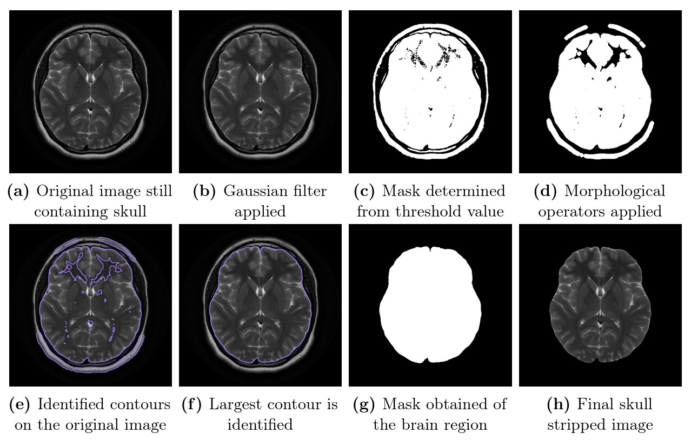
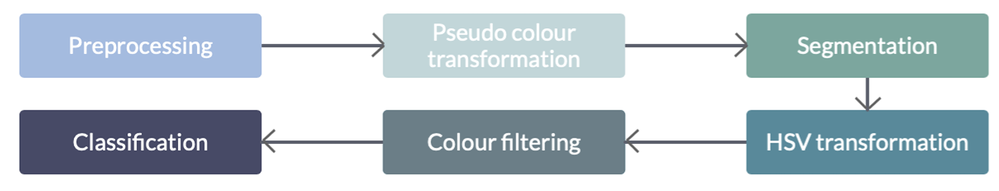
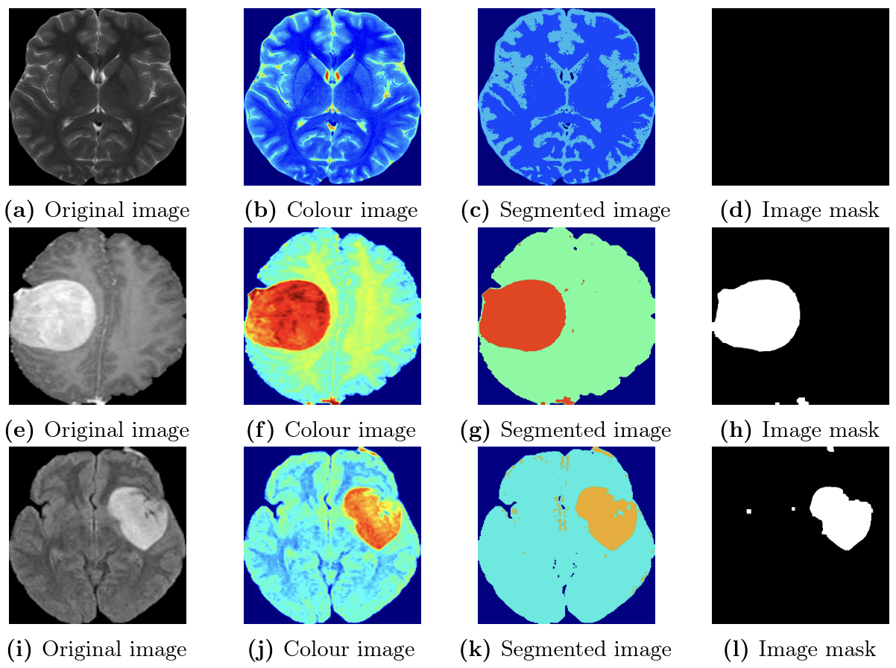
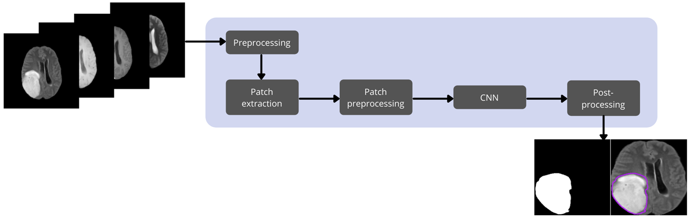
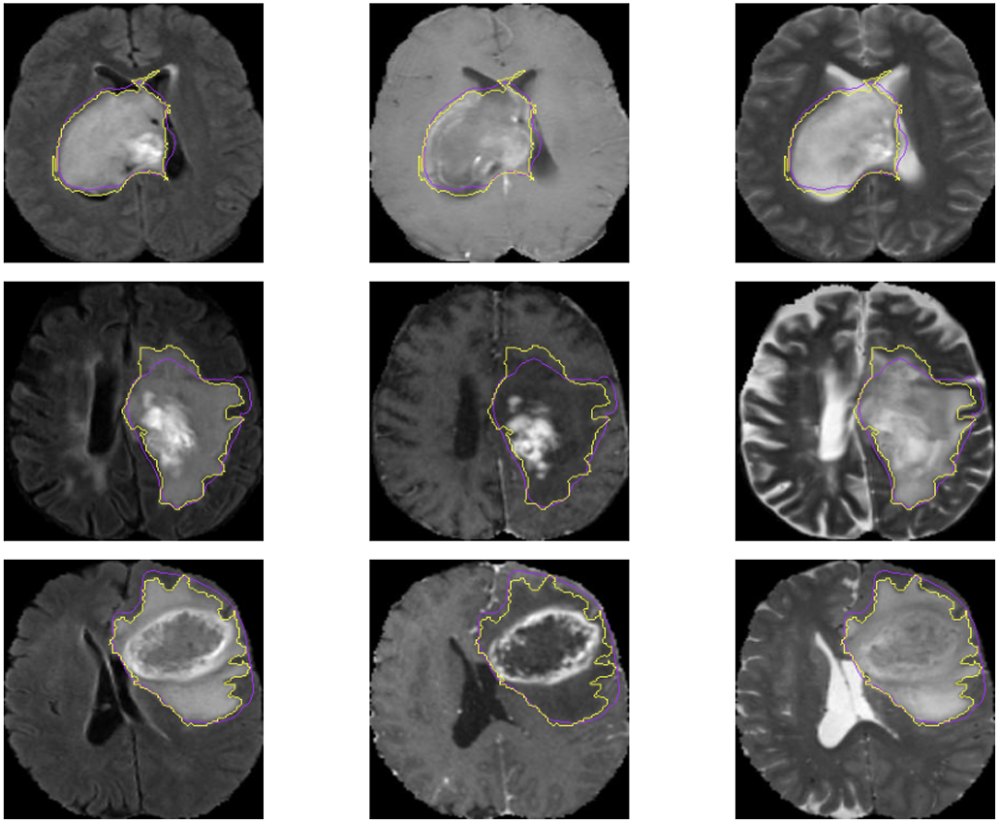

Honours project 2021
==============================
Title: The automated detection of brain tumours in MRI scans
==============================
by Alexandra Smith

- **preprocessing.py** takes the original images downloaded from Kaggle as well as from the MICCAI Multimodal Brain Tumour Segmentation (BraTS) challenge and applies various preprocessing techniques to obtain the final images used for model training
- **indv_modality.py** contains the functions for working with only one of the imaging modalities
- **all_modalities.py** contains functions for working with all 4 image modalities (image depth 4) which was used for the final project results
- **main.py** executes the training and testing of the model

The below figure depicts the steps executed in the skull stripping algorithm.

The first objective of the project was to determine whether or not a brain tumour is present in an MRI image, thereby classifying a brain as healthy or not. Various image processing and traditional machine learning techniques such as clustering were used. A flow chart depicting the method used in this stage is shown below.

Results from stage 1 of the project are shown below. Based on the proposed method, the system achieved classification accuracy of 65%.

The next stage of the project aimed to identify and segment the tumour in an image. This was achieved with a deep learning-based approach utilsing a convolutional neural network. A figure showing the stages of the proposed system is shown below.

Some segmentation results achieved by the CNN are shown below. The model achieved a mean Dice score of 0.9428 after 10-fold cross validation, with an average sensitivity and specificity of 0.9985 and 0.9683 respectively.

